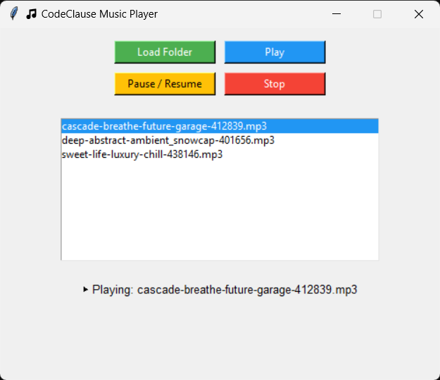
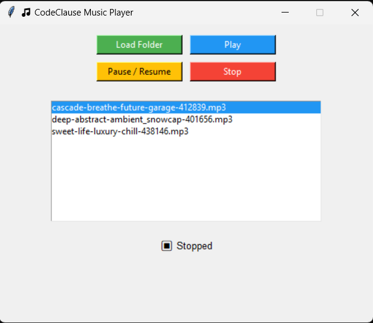

# 🚀 CodeClause Python Internship Tasks

## 🎵 Task: Music Player

### 📌 Description
- A Python-based **Command Line Music Player**
- Allows users to:
  - Load music from a folder  
  - Play music  
  - Pause / Resume playback  
  - Stop music  
- Plays `.mp3` files from a specified directory  
- Simple and interactive terminal-based application  

## 📂 Project Files
Make sure the following files and folders are present in the same directory:

```text
music_player.py
music/
 ├── cascade-breathe-future-garage-412839.mp3
 ├── deep-abstract-ambient_snowcap-401656.mp3
 └── sweet-life-luxury-chill-438146.mp3
```
## ⚙️ Technologies Used
- Python  
- Pygame  

## 📦 Required Libraries

Install the required Python library before running the project:

```bash
pip install pygame
```
## ▶️ How to Run

1. Open **Command Prompt** / **Terminal**
2. Navigate to the project directory
3. Run the following command:

```bash
python music_player.py
```
## 📸 Screenshots

### 🔹 Load Music Folder
<p align="center">
  
</p>

### 🔹 Play Music
<p align="center">
  
</p>

### 🔹 Pause / Resume Music
<p align="center">
  
</p>

### 🔹 Stop Music
<p align="center">
  
</p>


